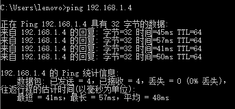
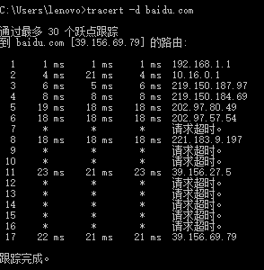

# 网络及分布式计算-Homework1

2017302580026 郑慧                        2020年2月25日

**1. ping另外一台计算机**

本题主要涉及ping命令，ping命令是一个十分强大的TCP/IP工具，可以通过ping IP地址来检测网络的连通情况和分析网络速度。

*解题思路*：通过[电信智能网关](http://192.168.1.1)，查阅到我连接家庭wifi手机的IP地址：192.168.1.4

通过ping命令来测试网络的连通性。

*运行截图*：

*分析*：

* 字节=32，数据包大小为32字节。

* 时间=45ms，响应时间，这个时间越小说明连接速度越快，每次的响应时间一般是不同.

* TTL=64，Time To Live，表示DNS记录在DNS服务器上存在的时间，它是IP协议包的一个值，告诉路由器该包何时需要被丢弃。不同操作系统的TTL值一般不同，TTL是由目标系统决定的，就像本次实验，目标系统是Android系统，TTL=64。

**2. tracert 一个服务器**

本题主要涉及tracert命令，tracert命令是路由跟踪程序，用于确定 IP 数据报访问目标所经过的路径。

*解题思路*：利用tracert命令，跟踪访问baidu.com主机所经过的所有路径，这里为了更快的显示路由器路径，我添加了一个-d参数，不需要将地址转换成主机名。

*运行截图*：

*分析*：

* 每次会发送3个数据包，故得到的返回时间也是3个。
* 请求超时，表示该节点的网络状态不太理想，没有在tracert规定的响应时间内作出响应，导致这种现象的原因可能是网络不稳定也可能是丢包。

