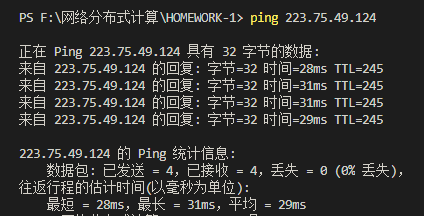
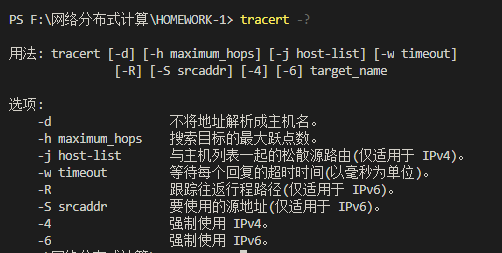
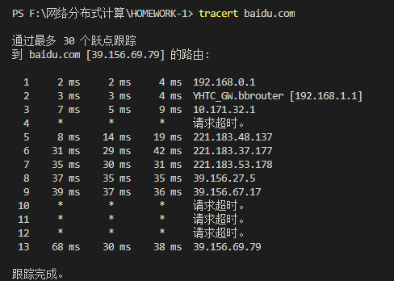

# HOMEWORK_1

1. ping一台主机

   - ping命令说明：ping命令我们很早之前就接触过了，而且也熟悉了它的使用和作用。简单的的来说，ping命令有以下几个作用：

     * 用来检测网络的连通情况和分析网络速度
     * 根据域名得到服务的IP地址
     * 根据ping返回的TTL值来判断对方所使用的操作系统及数据包经过路由器数量

   - ping命令的使用方法：

     
   
   - ping使用截图：
   
     

2. tracert一台服务器

   - tracert命令说明：tarcert命令以前没有接触过，查找资料了解到：tracert 是一个简单的网络诊断工具，可以列出分组经过的路由节点，以及它在IP 网络中每一跳的延迟。

   - tarcert命令的用法：

     

   * tracert使用截图：

     