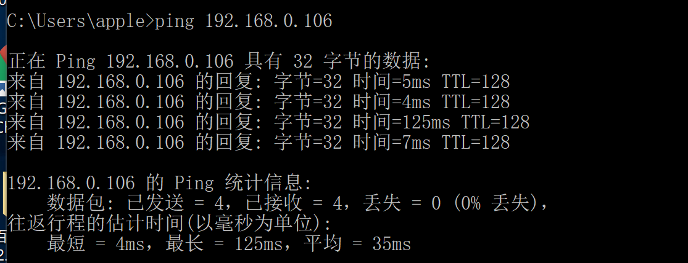
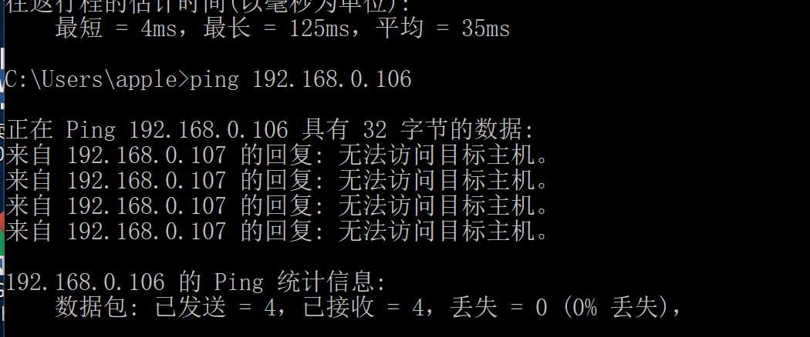
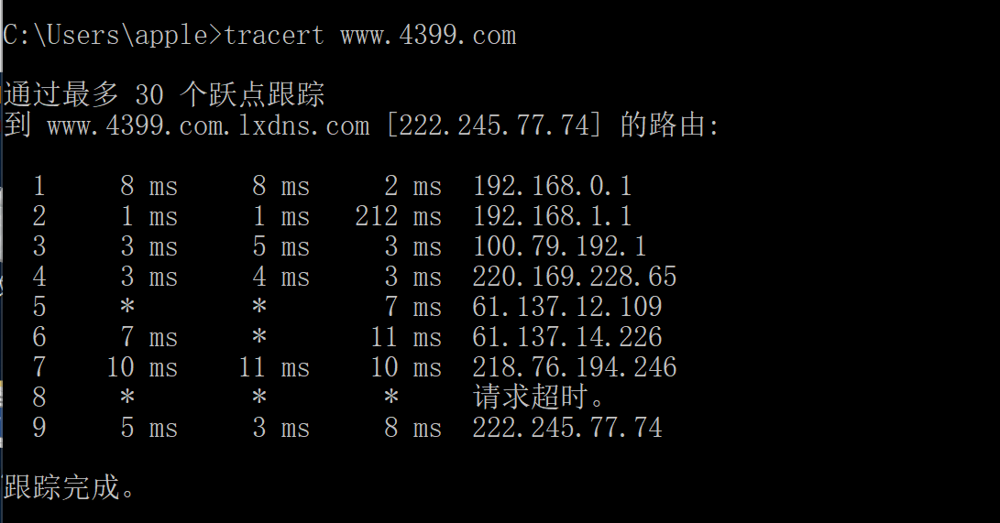

### 2017302580059 蒋加尧 第一次作业

#### 1.ping另外一台计算机

 ping命令作用：当你的机器不能访问Internet，首先确认是否是本地局域网的故障。ping命令就能起到检测的作用。假定局域网的代理服务器IP地址为202.168.0.1，可以使用ping 202.168.0.1命令查看本机是否和代理服务器联通。此外可以测试本机的网卡是否正常工作，使用 ping 127.0.0.1命令。

***
本次作业的第一个任务就是ping另外一台计算机
首先当本地局域网正常时进行测试，这里ping家里的主机192.168.0.106
>ping 192.168.0.106

截图如下：

可见，四次均成功，还能看到一些具体的时间数据
***
当本地局域网故障时，则无法ping通，就可得出无法访问internet的原因是本地局域网故障
这里我本机wifi断开。再次ping
>ping 192.168.0.106

截图如下：

ping不通，均丢失。与代理服务器无法连通
***
#### 2.Tracert一个服务器

  Tracert命令用来显示数据包到达目标主机所经过的路径（路由器），并显示到达每个节点（路由器）的时间。命令功能同Ping类似，但它所获得的信息要比Ping命令详细得多，它把数据包所走的全部路径、节点的IP以及花费的时间都显示出来。该命令比较适用于大型网络。

***
这里我们以tracert 4399小游戏网网站为例
>tracert www.4399.com

截图如下：

成功跟踪