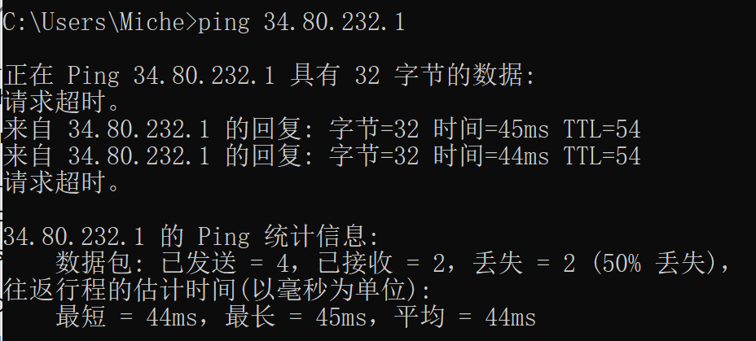
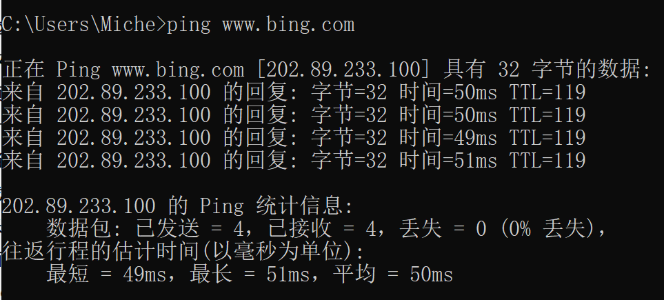
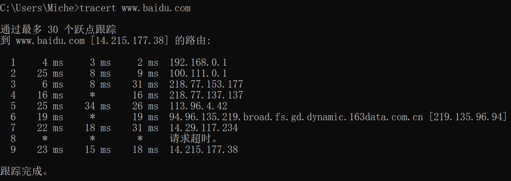
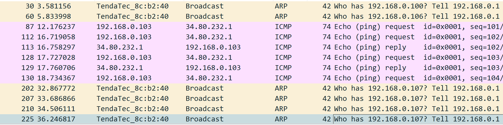

### HomeWork 1
---
#### 一. ping另外一台计算机
1. ping命令是依托于 **ICMP协议**的，这个协议是为了更高效地转发 IP数据报和提高交付成功的机会。一般ping命令需要经过 广播、ARP请求与响应、ping请求等流程，其中 **ARP协议**是在局域网下需要借助的协议，能够根据 IP地址查出计算机的**MAC地址**（用来标识计算机）
2. 下面 ping一台自己的云服务器，可能是由于服务器主机不在国内，有时会出现**丢包**现象，如下所示：

3. 如果是 ping 一个url, DNS会自动将其转为对应的 IP 地址，然后发出ping请求，这里 202.89.233.100就是这个网页的电脑主机的 IP地址（可以在浏览器 url 栏直接输入 IP地址来进入 bing 搜索页面）

---
#### 二. tracert 一个服务器
1. **Tracert**（跟踪路由）是一种路由跟踪程序，用来确定IP数据包访问目标所经过的路径。用IP携带的生存时间（TTL）字段和 ICMP 错误消息来确定从一个主机到网络上其他主机之间的路由。
2. 这里选择 百度 的服务器，进行路由跟踪，结果如下：

  其中 
- 第一列：表示的是节点数（第几个节点）
- 中间三列：显示的是各节点的响应时间（网络情况稳定的话，三者的响应时间差不多，否则，网络动荡），返回 * 表示超时
- 最后一列：显示经过的路由的IP地址
3. tracert命令会设置特定的 TTL（time-to-live）给 发向服务器沿途的路由器，给最近的第一个路由器设置 TTL=1，到达该路由器后 TTL - 1 = 0，包超时（exceed），此时路由器就会发送一个超时的响应给发送者（通过 ICMP协议）；然后发送者会再次设置 TTL=2 ，到达第二个路由器就会超时，响应发送者，直到最后一个路由器。响应的时间过长会出现 * ，代表网络状态不好或者该路由器隐藏了自己的 IP 地址，没有响应 ICMP请求

---
#### 三. 申请github账户，下载相关资源
1. 之前已经申请和使用过 github账户，并传给课代表

2. 通过 **git clone** 下载了 [wireshark github](https://github.com/wireshark/wireshark) 上的资源，尝试在ping服务器时观察 wireshark的输出，直观地显示出 Ping命令的过程如下：

