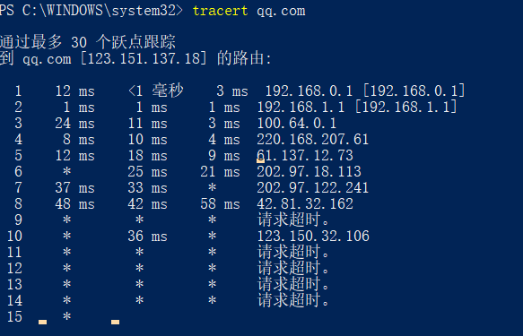

**1.ping另外的计算机**

- Ping是工作在 TCP/IP网络体系结构中应用层的一个服务命令， 主要是向特定的目的主机发送 ICMPEcho 请求报文，测试目的站是否可达及了解其有关状态 。ping可以确定本地主机是否能与另一台书记成功交换数据包。

  

**2.tracert一个服务器**

-  Tracert是路由跟踪程序，用于确定 IP 数据报访问目标所经过的路径。Tracert 命令用 IP 生存时间 (TTL) 字段和 ICMP 错误消息来确定从一个主机到网络上其他主机的路由。 在工作环境中有多条链路出口时，可以通过该命令查询数据是经过的哪一条链路Tracert一般用来检测故障的位置，我们可以使用用tracert IP命令确定数据包在网络上的停止位置，来判断在哪个环节上出了问题，虽然还是没有确定是什么问题，但它已经告诉了我们问题所在的地方，方便检测网络中存在的问题。
  - 从下面的图片中可以看出。图中出现的*表示返回的消息是超时，表示该路由节点和我们使用的宽带无法联通。

