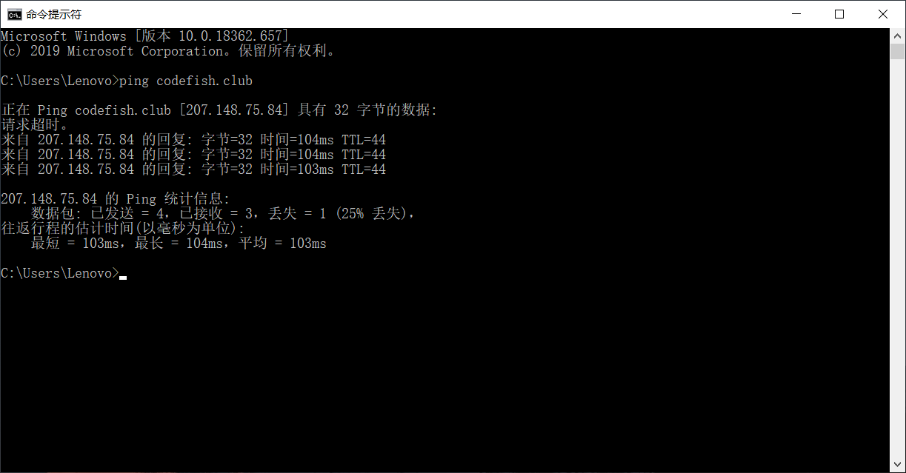
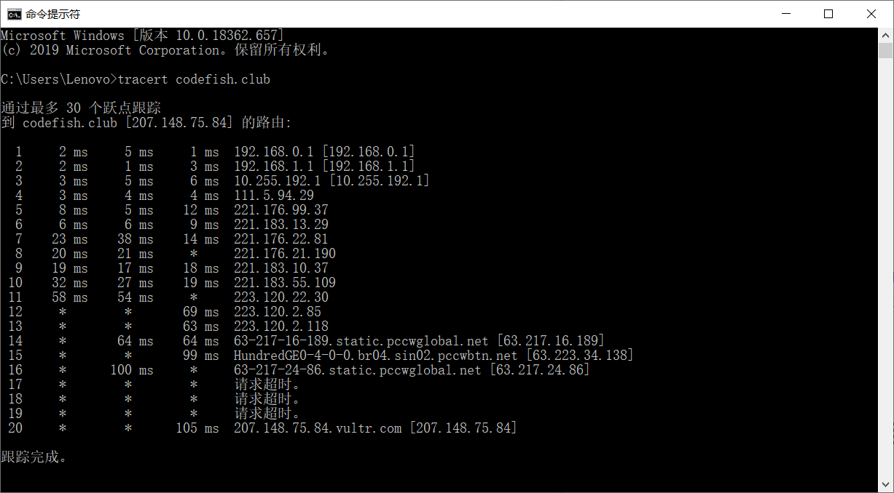

# Homework_1

**Author：**

单位：武汉大学计算机学院2017级软件工程专业本科生

姓名： 王泽生

学号：2017302580268

Github： https://github.com/CodeJohnFish 

**环境说明：**

本机：win10

服务器：

| Item   | 说明                                 |
| ------ | ------------------------------------ |
| IP地址 | 207.148.75.84                        |
| 域名   | codefish.club                        |
| 服务器 | 经VPS提供商vultr购买的服务器(CentOS) |

## 1 ping 另一台计算机

### 1.1 ping简介

PING （Packet Internet Groper），因特网包探索器，用于**测试网络连接量**的程序。Ping是工作在**TCP/IP 网络体系结构中应用层**的一个服务命令， 主要是**向特定的目的主机发送ICMP（Internet Control Message Protocol 因特网报文控制协议）ECHO 请求报文**，**测试目的站是否可达及了解其有关状态** .

### 1.2 ping截图

### 1.3 结果说明

本机向特定的目的主机发送了ICMP ECHO请求报文，经测试，该目的主机可达，但有丢包情况存在。

codefish.club是一台linux主机，经过了64-44=20次中转之后到达本机，时间为104ms，是一次请求的时间，时间越小说明速度越快。

> 加深理解

ping用于确定本地主机是否能与另一台主机成功交换(发送与接收)数据包，再根据返回的信息，就可以推断TCP/IP参数是否设置正确，以及运行是否正常、网络是否通畅等。Ping命令可以进行以下操作  :

①通过将ICMP(Internet控制消息协议)回显数据包发送到计算机并侦听回显回复数据包来验证与一台或多台远程计算机的连接。

②**每个发送的数据包最多等待一秒**。

③打印已传输和接收的数据包数。

需要注意的是，Ping成功并不一定就代表TCP/IP配置正确，有可能还要执行大量的本地主机与远程主机的数据包交换，才能确信TCP/IP配置的正确性。如果执行ping成功而网络仍无法使用，那么问题很可能出在网络系统的软件配置方面，**ping成功只保证当前主机与目的主机间存在一条连通的物理路径** 。

## 2 tracert 一个服务器

### 2.1 tracert简介

Tracert（跟踪路由）是**路由跟踪**实用程序，用于**确定 IP 数据包访问目标所采取的路径**。Tracert 命令用 IP 生存时间 (TTL) 字段和 ICMP 错误消息来确定从一个主机到网络上其他主机的路由。 

### 2.2 tracert一个服务器截图

### 2.3 tracert结果说明

通过向目标发送**不同IP生存时间 (TTL) 值的“Internet控制消息协议 (ICMP)”回应数据包**，Tracert诊断程序确定到目标所采取的路由。要求路径上的**每个路由器在转发数据包之前至少将数据包上的 TTL 递减 1**。数据包上的 TTL 减为 0 时，路由器应该将“ICMP 已超时”的消息发回源系统。

**Tracert 先发送 TTL 为 1 的回应数据包，并在随后的每次发送过程将TTL递增 1，直到目标响应或 TTL 达到最大值，从而确定路由。**通过检查中间路由器发回的“ICMP 已超时”的消息确定路由。某些路由器不经询问直接丢弃 TTL 过期的数据包，这在 Tracert 实用程序中看不到。

## 3 申请Github账号，下载相关资源

1. 之前已注册使用过Github账户，现已将**单位**设置为 CS, Wuhan University

2. 下载了相关资源：Https://github.com/wireshark/wireshark

   尝试了三种方式进行下载：

   1. 直接在一个空文件夹使用 Git bash 拉取
   2. 直接 Download 压缩包
   3. 注册登陆码云账号，新建仓库，导入已有仓库，填入github地址，然后进行下载

   注：前两种方式速度很慢，即便科学上网也未能解决，第三种方式下载速度很快

3. Wireshark（前称Ethereal）是一个**网络封包分析软件**。网络封包分析软件的功能是**撷取网络封包，并尽可能显示出最为详细的网络封包资料**。Wireshark使用WinPCAP作为接口，**直接与网卡进行数据报文交换**。