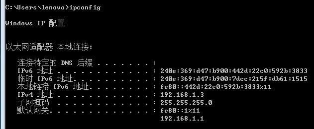
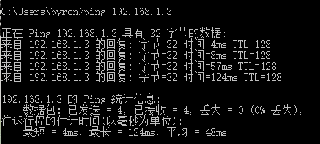
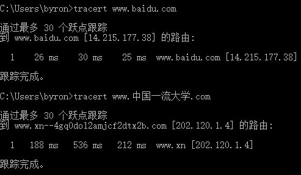

# DNAP-Homework-1

## 1. ping另外一台计算机

* 利用ipconfig指令查看家里另一台计算机的ip地址

* 在相同局域网ping另一台计算机的ip

ping命令通过发送数据包并接收应答信息来检测两台计算机是否连通,也可以通过TTL的值来知道目标主机的OS(不一定准确因为TTL值可以修改),除此之外ping命令还可以用来检测网络问题.

## 2. tracert一个服务器

tracert命令可以查询从本机到该IP地址所在的电脑要经过的路由器及其IP地址.5列信息分别表示:生存时间(经过路由数)、3次发送ICMP包返回时间、途径路由器的ip地址.运行实例如上图.

