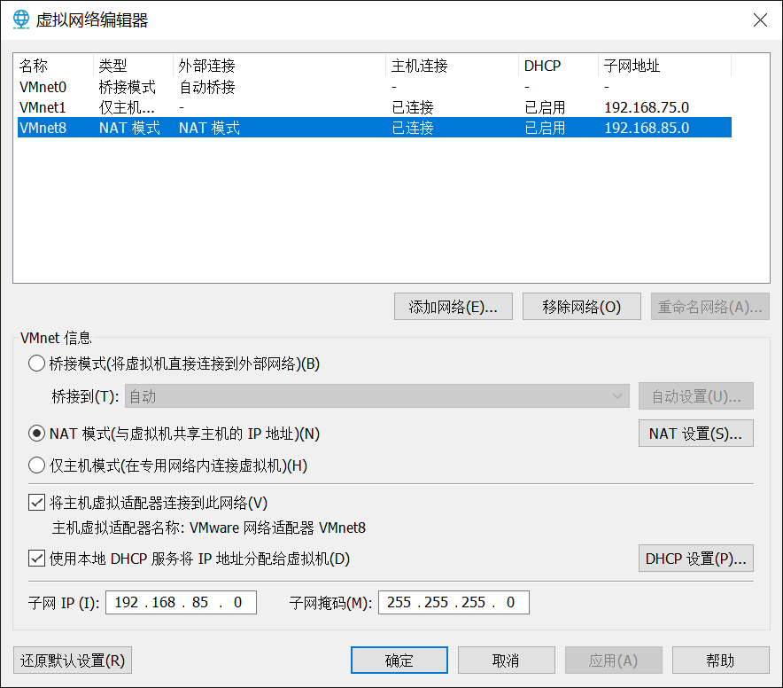
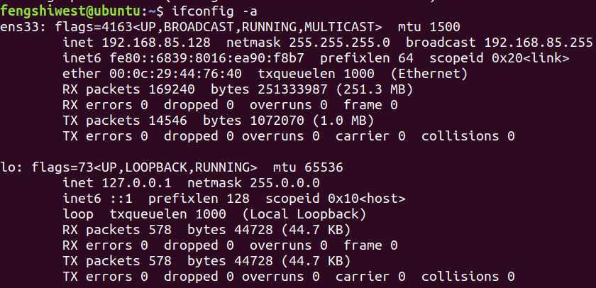
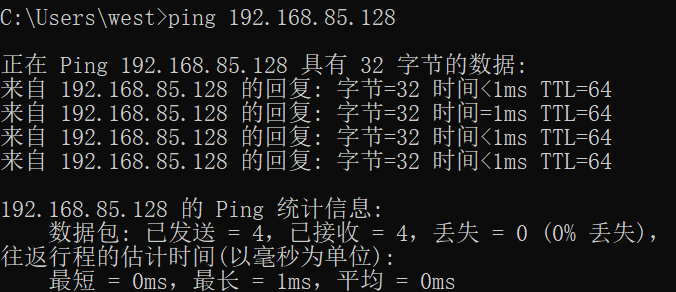
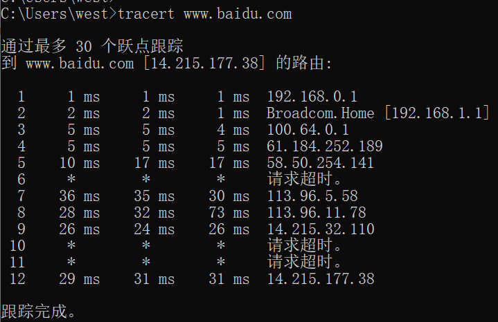

###                                         Homework Week 1

#### 1. Ping 另外一台计算机

1. 首先打开 `cmd`，输入 `ping /?` 获取ping指令的使用方法

2. 得到用法为：
   ```
   ping [-t] [-a] [-n count] [-l size] [-f] [-i TTL] [-v TOS][-r count] [-s count] [[-j host-list] | [-k host-list]][-w timeout] [-R] [-S srcaddr] [-c compartment] [-p] [-4] [-6] target_name
   
   选项:
   -t             Ping 指定的主机，直到停止。
               若要查看统计信息并继续操作，请键入 Ctrl+Break；
                  若要停止，请键入 Ctrl+C。
   -a             将地址解析为主机名。
   -n count       要发送的回显请求数。
   -l size        发送缓冲区大小。
   -f             在数据包中设置“不分段”标记(仅适用于 IPv4)。
   -i TTL         生存时间。
   -v TOS         服务类型(仅适用于 IPv4。该设置已被弃用，
                  对 IP 标头中的服务类型字段没有任何
                  影响)。
   -r count       记录计数跃点的路由(仅适用于 IPv4)。
   -s count       计数跃点的时间戳(仅适用于 IPv4)。
   -j host-list   与主机列表一起使用的松散源路由(仅适用于 IPv4)。
   -k host-list    与主机列表一起使用的严格源路由(仅适用于 IPv4)。
   -w timeout     等待每次回复的超时时间(毫秒)。
   -R             同样使用路由标头测试反向路由(仅适用于 IPv6)。
                  根据 RFC 5095，已弃用此路由标头。
                  如果使用此标头，某些系统可能丢弃
                  回显请求。
   -S srcaddr     要使用的源地址。
   -c compartment 路由隔离舱标识符。
   -p             Ping Hyper-V 网络虚拟化提供程序地址。
   -4             强制使用 IPv4。
   -6             强制使用 IPv6。`
   ```

3. 打开虚拟机 查看子网IP地址为`192.168.85.0`

   

   进一步使用`ifconfig -a`命令得到虚拟机IP地址为`192.168.85.128`

   

4. 输入命令`ping 192.168.85.128`

   得到结果：

   

### 2. Tracert 一个服务器

1. 首先打开 `cmd`，输入 `tracert /?` 获取tracert指令的使用方法

2. 得到用法为：

   ```
   tracert [-d] [-h maximum_hops] [-j host-list] [-w timeout][-R] [-S srcaddr] [-4] [-6] target_name
   
   选项:
       -d                 不将地址解析成主机名。
       -h maximum_hops    搜索目标的最大跃点数。
       -j host-list       与主机列表一起的松散源路由(仅适用于 IPv4)。
       -w timeout         等待每个回复的超时时间(以毫秒为单位)。
       -R                 跟踪往返行程路径(仅适用于 IPv6)。
       -S srcaddr         要使用的源地址(仅适用于 IPv6)。
       -4                 强制使用 IPv4。
       -6                 强制使用 IPv6。
   ```

3. 输入指令`tracert www.baidu.com`

4. 得到结果：

   