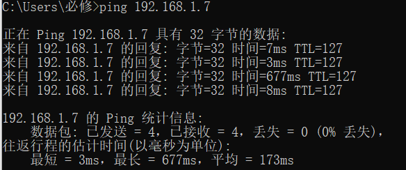

# HOMEWORK_1
* ping主机  
    - ping为网络诊断工具，用于确定本地主机是否能与另一台主机成功交换
    (发送与接收)数据包，再根据返回的信息，就可以推断TCP/IP参数是否设置正确，
    以及运行是否正常、网络是否通畅等  
    
---
* tracert一个服务器  
	**tracert参数说明**  
	- -d 指定不将IP地址解析到主机名(默认情况会解析主机名)。  
    - -h maximum_hops 指定跃点数以跟踪到称为 target_name的主机的路由。
    - -j 指定 Tracert实用程序数据包所采用路径中的路由器接口列表。
    - -w 等待 timeout为每次回复所指定的毫秒数。
    - -target_name 目标主机的名称或IP地址。  
    
---  
* 申请了github账号，并将单位设置为CS, Wuhan University。之后将wireshark从git上拉取到本地  
    
	
